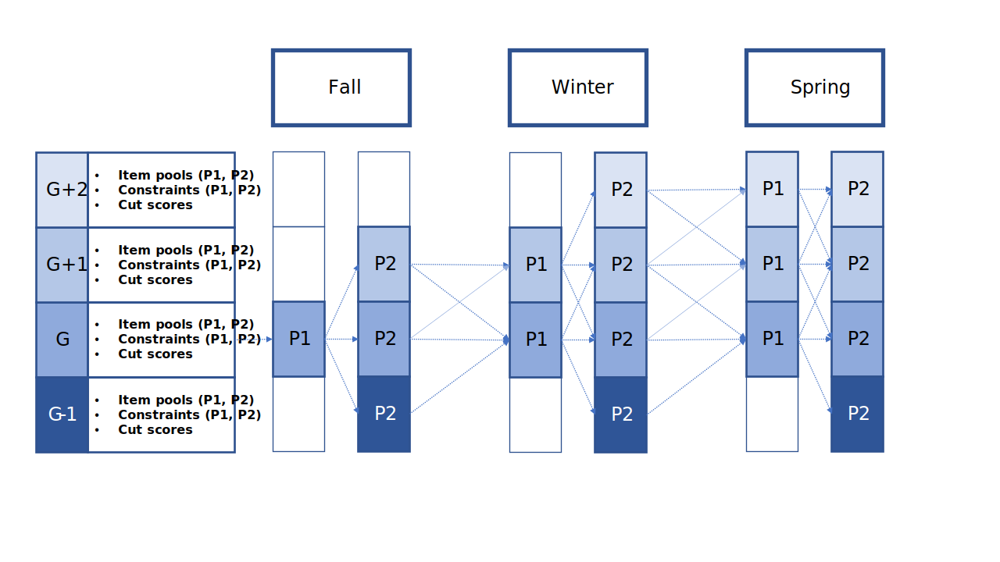
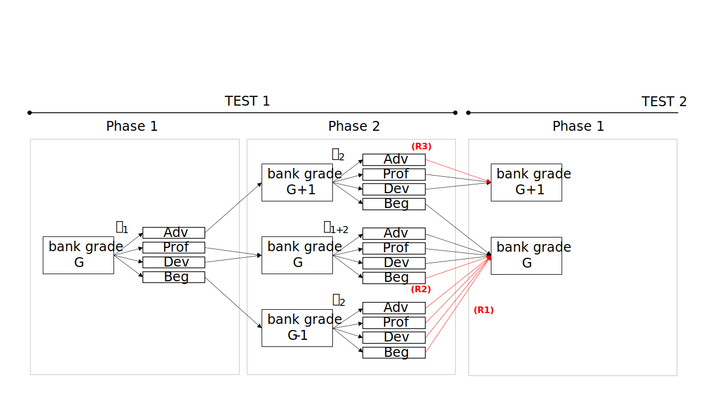
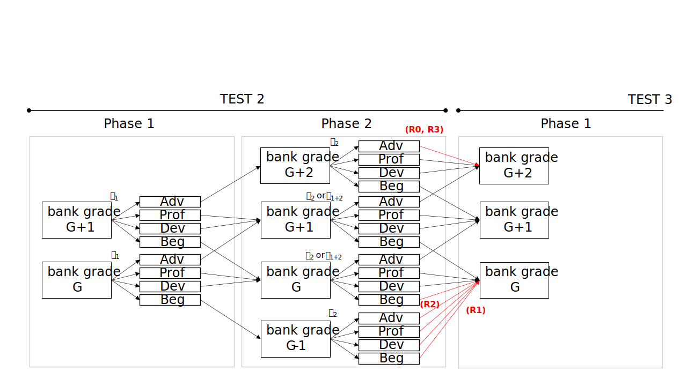
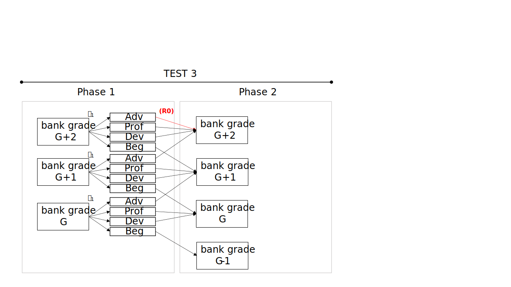

```{r, echo = FALSE, message = FALSE}
library(maat)
library(knitr)
library(kableExtra)
```

# Introduction

The **maat** package performs adaptive testing based on the assessment framework involving multiple tests administered throughout the year using multiple item pools vertically scaled and multiple phases within each test administration [@choi_maat_2022]. It allows for transitioning from one item pool with associated constraints to another as determined necessary according to a prespecified transition policy to enhance the quality of measurement. Based on an item pool and test blueprint constraints, each phase or module is constructed as a computerized adaptive test (CAT) assembled dynamically using the shadow-test approach to CAT [@van_der_linden_model_1998]. The current version of **maat** supports an assessment design involving three tests/administrations (e.g. Fall, Winter, and Spring) with two phases within each administration (Phase 1 and Phase 2), so that an examinee takes six modules in total throughout the year. The assessment framework is adaptive in multiple levels:

* _Within phases_ - items are administered adaptively
* _Between phases_ - item pools are selected adaptively
* _Between tests_ - item pools are selected adaptively

# Assessment Structure

```{r, echo = FALSE, out.width = "900px", fig.ext = "svg"}

```

An assessment under the multiple administrations adaptive testing design has the following structure.

* **Assessment**: An assessment is composed of multiple administrations over time, with the current version supporting three administrations (e.g., Fall, Winter, and Spring).
* **Administration (Test)**: Each test/administration consists of two phases (Phase 1 and Phase 2) between which transitions to a higher/lower item pool are permitted if needed. Transitions to a higher/lower item pool can also occur between administrations. 
* **Phase**: Each phase involves its own item pool and test specifications/constraints to be used in assembly.
* **Module**: Three administrations x two phases give six modules in total.
  * Each examinee takes six modules across three administrations within the assessment.
  * In each module, a fixed-length adaptive test is assembled in real time using the shadow-test approach to CAT.

* **Number of item pools required for the entire assessment**
  * For the full assessment, an item pool is required for each grade in the range. For example, if the range to which the 4th grade (G4) examinees can be routed is G3-G6, then all four item pools (G3, G4, G5, and G6) are required for the assessment.
  * Students begin the first module of the first test (e.g., Fall Phase 1) with an item pool (and test specifications) corresponding to their grade level of record. Students are assessed with the same item pool for the entire assessment if their ability estimates remain within the measurement range of the item pool. Otherwise, they are routed to a higher/lower item pool upon completing a module. 

* **Routing policy**: Based on a routing policy (described in detail below), examinees are routed to a grade level after completing each module.

# Assumptions

Several assumptions are made to support the multiple administrations adaptive testing design.

* **Item Pool**:
  * Items in the item pools across grades are vertically scaled and articulated.
  * Item parameters from Phase 1 and Phase 2 are on the same metric, and thus can be combined to develop a single ability estimate of the examinee.
  * Test scores are computed based on item responses from Phase 1 and Phase 2 combined as the administration-level scores. 
  * The ability/trait scores for examinees across administrations are expected to change (and not assumed to remain constant).
  * The vertical scale is robust and well-articulated across the grades. For all $G=4, 5, \dots$,
    *	the mean item difficulty of grade $G-1$ pool is lower than grade $G$ pool;
    *	the minimum item difficulty of grade $G-1$ pool is lower than grade $G$ pool;
    *	the maximum item difficulty of grade $G-1$ pool is lower than grade $G$ pool.
  
* **Module assembly**:
  * Student-level item overlap control is enforced across administrations and/or phases.
  * The starting theta of the first module (Fall Phase 1) is the mean item pool difficulty of the grade of record. The same starting theta is used for all examinees for the first module. All subsequent modules are initialized individually based on the previous score.
  * Throughout the assembly process, no distinction is made between the ability estimate and the target $\theta$ that is used to assemble tests. The ability estimate is always used as the target $\theta$ for the assembly.

# Module Assembly

A module is a fixed-length adaptive test constructed under the shadow-test framework. This section describes how each module is assembled.

## Content Balancing Algorithm

The shadow-test approach to CAT [@van_der_linden_model_1998; @choi_ensuring_2018] was developed to balance the need for sequential and simultaneous optimization in constrained CAT. The shadow-test approach uses the methodology of mixed-integer programming (MIP) to simultaneously select a full set of items conforming to all content and other constraints and yet optimal (e.g., most informative).

Given the item pool and test specifications/constraints, the shadow-test approach to CAT assembles a full-length test form, called a shadow test, using MIP for each item position upon updating interim $\theta$ estimates, $\theta_{k}$, $k = 1,2,...,n$, where $n$ is the test length. The optimal test assembly engine uses MIP to construct shadow tests optimized for the interim $\theta$ estimates and conforming to all specifications and requirements, encompassing content constraints, exposure control, overlap control, and other practical constraints (e.g., enemy items, item types, etc.). The cycle is repeated until the intended test length $n$ has been reached.

The methods by which the shadow-test approach formulates test assembly problems as constrained combinatorial optimization have been documented in @van_der_linden_linear_2005 and implemented in the `TestDesign` package [@choi_testdesign_2021]. Refer to @choi_ensuring_2018 for more information about how the shadow-test approach creates an adaptive test as a sequence of optimally constructed full-length tests.

## Item Selection Criteria

A standard procedure for choosing a shadow test (for a given examinee at a particular item position) among potentially an astronomical number of alternatives is to compare the objective values provided by the alternatives. The common objective function in its simplest form is:

$$
\text{maximize}
\sum_{i\,=\,1}^{I}
I_{i}(\hat{\theta})x_{i}
$$

where $I_{i}(\hat{\theta})$ is the Fisher information for Item $i$ at an estimated $\theta$ value. It is also possible to add a random component to the objective function to reduce the overexposure of highly informative items for some or all item positions within a test. For example, the progressive method [@revuelta_comparison_1998] can be incorporated into the objective function so that at the beginning of the test the objective function combines a random component with item information, and as the test progresses the random component is reduced proportionately.

Upon constructing/updating a shadow test, a single item is selected to be administered. Selecting an item from a shadow test is typically done by selecting the most informative item in the shadow test that has not been administered, as

$$
\text{arg} \max_{i\,\in\,R}
I_{i}(\hat{\theta}),
$$

where $R$ indicates the set of items in the current shadow test that has not been administered to the examinee. When the test is comprised of item sets (e.g., reading passages), selecting a passage should precede selecting an item, which can be based on the average item information within each passage. Once a passage is selected, typically multiple items are selected before moving onto another passage.

## How Passages Are Selected

In the MIP optimizer, passages are selected not directly but as a result of attempting to satisfy constraints. Given an item pool that has $I$ items, a discrete assembly problem (i.e., not passage-based) uses $I$ decision variables that represent each item in the pool. In a passage-based assembly that has $S$ available passages in the pool, $S$ more decision variables are added to existing $I$ decision variables. The nested structure between items and passages is provided to the solver through the use of constraints. 

Using the same information maximization criterion presented above, a shadow-test that satisfies the criterion and the constraints is assembled/re-assembled for the administration of each item. From the shadow-test, the passage to be administered to the examinee is determined using the following process.

First, if the examinee is currently not within a passage, the passage that has the largest mean information at the current $\hat{\theta}$ is selected as the passage to be administered. The mean information is calculated from the shadow test. For example, suppose that Passage 1 consists of Items 1, 2, 3, 4, 5, and only Items 1, 2, 3 were included in the shadow test. In this case, the mean information of Passage 1 is computed from Items 1, 2, 3. After selecting a passage with the highest mean information, the item within the passage that has the largest information at the current $\hat{\theta}$ is administered to the examinee. This marks the passage as the currently active passage.

For the next shadow test, the assembly engine enforces to select previously administered items and passages, and the currently active passage that contains the item. In this step, for the currently active passage, a different combination of items may be selected in the shadow test. For example, suppose that Passage 1 consists of Items 1, 2, 3, 4, 5, and the constraint is to administer 3 items for each passage. If Items 1, 2, 3 were selected previously and Item 1 was administered, it is possible that Items 1, 3, 5 will be selected in the current shadow test. Given the combination, either Item 3 or 5 will be administered to the examinee depending on which item has the largest information.

## Exposure Control

The maximum-information item-selection criterion causes overexposure of a small proportion of items while underexposing the rest. The shadow-test approach mitigates the problem by adding random item eligibility constraints to the test-assembly model so that items with higher exposure rates have higher probabilities of being temporarily ineligible. The `TestDesign` package implements the conditional item eligibility control method recently improved and extended [@van_der_linden_improving_2019]. For each examinee the `TestDesign` engine determines which items to constrain as temporarily ineligible from the item pool. The engine can also monitor the probabilities of ineligibility for all items conditional on different theta levels such that the exposure rates for all items in the pool are tightly controlled within and across different theta segments (intervals) and bound below a maximum exposure rate set *a priori* (e.g., $r^{\max}=0.25$).

More specifically, for each new examinee, prior to the administration of the test, the item eligibility control method conducts Bernoulli experiments (by theta segment) for the items in the pool to determine their eligibility for administration with probabilities updated as a function of the actual exposure rates of the items. For any items determined to be ineligible additional constraints are included in the test assembly model as follows:

$$
\sum_{i\,\in\,V_j}{x_i} = 0
$$

where $x_i$ is the binary decision variable for the selection of item $i$; and $V_j$ denotes the set of items determined to be ineligible for Examinee $j$.

The conditional item eligibility method monitors and updates the probabilities within a predetermined set of theta segments, e.g., $\theta_1 \in [-\infty,-1.5), \theta_2 \in [-1.5,-.5), \dots , \theta_G \in (1.5, \infty]$. The conditional item-eligibility probabilities are represented as a recurrence relationship as follows:

$$
\text{Pr}\{E_i | \theta\}
\leq
\frac{r^{\max}}
{\text{Pr}\{A_i | \theta\}}
\text{Pr}\{E_i | \theta\},
$$

where $\text{Pr}\{E_i | \theta\}$ is the conditional eligibility probability for item $i$ given $\theta \in \theta_g$; and $\text{Pr}\{A_i | \theta\}$ is the conditional exposure probability (rate) for the item. Theoretically, $\text{Pr}\{A_i | \theta\}$ can be updated continuously as each examinee finishes the test. Assuming $l = 1,2,\dots$ denote the sequence of examinees taking the test. The conditional item-eligibility probabilities can be updated continuously as:

$$
\text{Pr}^{l+1}\{E_{i}|\theta\} = \min
  \bigg\{
    \frac{r^{\max}}
    {\text{Pr}^{l}\{A_{i}|\theta\}}
    \text{Pr}^{l}\{E_{i}|\theta\}, 1
  \bigg\}
$$

However, in the context of a large number of concurrent test instances updating the exposure counts in real time after each instance can be difficult and perhaps not necessary. One complication with the conditional item eligibility control method is that as the test progresses examinees may move in and out of segments and can be subject to different sets of eligible items as they typically visit more than one theta segment over the course of a test administration. @van_der_linden_improving_2019 elaborates the issue and provides a workaround. Unconditional exposure control is much more straightforward to implement and can be preferred in many testing situations. The `TestDesign` package implements the conditional item eligibility control method based on configurable $\theta$ segments. Defining one big segment of $\theta$ simplifies the method to the unconditional case.

## Overlap Control

Overlap control might be needed to prevent or reduce the amount of intra-individual overlap in test content across administrations. The item eligibility control method can be used to make all items previously seen by the examinee ineligible for the current administration by imposing constraints similarly as

$$
\sum_{i\,\in\,S_{j}}{x_{i}} = 0,
$$

where $s_j$ denotes the set of items Examinee $j$ has seen prior to the current administration. Imposing these hard constraints can unduly limit the item pool and potentially affect the quality of measurement. To avoid infeasibility and degradation of measurement, we can impose soft constraints in the form of a modification to the maximum information objective function as

$$
\text{maximize}
  \sum_{i\,=\,1}^{I}I_{i}{(\theta) x_{i}}
  \, – \,
  M \sum_{i\,\in\,s_{j}}{x_{i}},
$$

where $M$ is a penalty for selecting an item from $s_j$ the subset of items previously administered to Examinee $j$. This modification to the objective function can effectively deter the selection of items previously administered unless absolutely necessary for feasibility of the model.

Although the same item eligibility constraints for inter-individual exposure control can be used to control intra-individual item overlap, the mechanism for identifying ineligible items for the intra-individual overlap control is quite different. It requires tracking the examinee records across test administrations, which may be days, weeks, or months apart. As the number of administrations increases, the ineligible item set ($s_j$) can grow quickly and adversely affect the quality of measurement progressively. To prevent the ineligible item set from growing quickly, $s_j$ may need to be defined based only on the immediately preceding test administration. Another possibility is to let the penalty $M$ be subject to exponential decay over test administrations:

$$
M\cdot e^{-\lambda t},
$$

where $\lambda$ is a disintigration constant; and $t$ is a time interval in some unit.

The **maat** package uses hard constraints to perform overlap control. Three options are available:

* `all`: If an examinee sees an item, then the item is excluded from shadow tests in all subsquent modules. For example, if an examinee sees an item in Phase 1 Administration 1, then the item is excluded in Phase 2 Administration 1 and all subsequent phases and administrations. In passage-based assembly, if an examinee sees at least one item from a passage, then the entire passage is excluded from shadow tests in all following modules.
* `within-test`: If an examinee sees an item, then the item is excluded from shadow tests in following phases within the current administration. The item is again made available in the subsequent administrations. For example, if an examinee sees an item in Phase 1 Administration 1, then the item is excluded in Phase 2 Administration 1 but is made available in Phase 1 Administration 2. Similar is done for passage-based assembly.
* `none`: A examinee can see any item twice (or more) in any phases and administrations. For example, if an examinee sees an item in Phase 1 Administration 1, the examinee can see the same item in Phase 2 Administration 1.

## Stopping Rule

The stopping rule describes the criteria used to terminate a CAT. The stopping rule is based on the number of overall required points and the total number of items denoted in the constraint file.

## Ability Estimation

The **maat** package supports expected a posteriori (EAP), maximum likelihood estimation (MLE) and maximum likelihood estimation with fence (MLEF) available in the `TestDesign` package for $\theta$ estimation. The estimation method must be specified in `createShadowTestConfig()`.

The MLE and MLEF methods in `TestDesign` has extra fallback routines for performing CAT:

* For MLE, if the response vector is extreme (i.e., the sum is 0 or the maximum for all items), EAP is used instead of MLE to obtain the $\theta$ estimate. This is because MLE estimates for extreme vectors is either $-\infty$ or $+\infty$.
* For MLEF, the two fence items are only added when the response vector is extreme. If the response vector is not extreme, a regular MLE is performed without any fence items. The purpose of this routine is to reduce the computation time spent in augmenting extra items.

In a `maat()` simulation, two types of ability estimates are obtained after completing each module.

* The **Phase-wise** estimate is obtained by only using the response from the current module. For example, after completing Phase 2 Administration 1, which say consists of 20 items, the phase-wise estimate is computed based on a 20-item response vector.
* The **Administration-wise** estimate is obtained by using the responses from both modules in the current administration. For example, after completing Phase 2 Administration 2 with 20 items and the Phase 1 Administration 2 with 15 items, the administration-wise estimate is computed based on all 35 items. This is always performed regardless of the `combine_policy` option in `maat()`. The `combine_policy` option is implemented to determine which type of ability estimate to use for routing, after computing both phase-wise and administration-wise ability estimates.

In each module (except for the very first), the initial estimate that is in place before administering the first item, is the final routing estimate from the previous module. The initial estimates can be manually specified for each examinee and for each module by supplying a list to the `initial_theta_list` argument in `maat()`. The list must be accessible using `initial_theta_list[[module_index]][[examinee_id]]`. In the example assessment structure in this document, `module_index` ranges from 1 to 6. The value of `examinee_id` is a string that is used in the `examinee_list` object.

# Routing Policy

Transitioning between phases and between tests are governed by the rules described in this section. These so-called transition rules are generally based on theta estimates (and confidence intervals) and the cut-scores defining the performance levels for each grade. There are also restrictions that override the general rules. Two routing rules are implemented in the **maat** package: Confidence Interval Approach and Difficulty Percentile Approach.

## Cut Scores

The cut scores for achievement levels must be defined to be able to perform routing between grades. For example, if there are four achievement levels (e.g., Beginning, Developing, Proficient, and Advanced), then three cut scores are necessary for each grade.

## Routing Structure

Routing is performed between modules and also between tests. For example, routing is performed between Fall Phase 1 and Fall Phase 2, and also between Fall Phase 2 and Winter Phase 1. Because an examinee takes 6 modules in total, routing is performed 5 times for the examinee throughout the entire assessment.

The routing structure is now described. Let $G$ denote the grade of record of an examinee.

* All examinees begin at grade $G$, the grade of record.

* After completing a module, a routing theta is determined. The routing theta is used to:
  * Determine the achievement level using cut scores
  * Perform routing depending on the achievement level
  * Use as starting theta in the next module

* Different types of $\theta$ estimates are used for the routing theta.
  * $\theta_{1}$ is an estimate based on Phase 1 items only.
  * $\theta_{2}$ is an estimate based on Phase 2 items only.
  * $\theta_{1+2}$ is an estimate based on the combined set of Phase 1 and Phase 2 items.

* In each administration, after completing Phase 1, $\theta_1$ is used as the routing theta for the following module.
* In each administration, after completing Phase 2, the ability estimate from the current *administration* is used as the routing theta. This is either $\theta_2$ or $\theta_{1+2}$ depending on the combine policy:
  * If combine policy is `always`, then $\theta_{1+2}$ is used as the routing theta;
  * If combine policy is `never`, then $\theta_2$ is used as the routing theta;
  * If combine policy is `conditional`:
    * If the examinee was in the same grade in Phase 1 and 2, then $\theta_{1+2}$ is used as the routing theta;
    * Else, then $\theta_2$ is used as the routing theta.

* Using the routing theta and the cut scores, the achievement level is determined. The achievement level is:
  * Advanced 
  * Proficient-Developing
    * In **maat** package, no distinction is made between Proficient and Developing.
  * Beginning

* Using the achievement level, routing is performed:
  * Advanced: change grade by $+1$;
  * Proficient-Developing: change grade by $0$;
  * Beginning: change grade by $-1$.
  
* There are four restrictions imposed by default on the routing rule.
  * **Restriction R0**: Only allow routing within $[G - b_L, G + b_U]$, where $b_L$ and $b_U$ are lower and upper bounds. The default lower bound is $b_L = 1$ and the upper bound is $b_U = 2$;
  * **Restriction R1**: If grade is $G - 1$ in Phase 2 of any administration, ignore achievement level and always change grade by $+1$;
  * **Restriction R2**: If grade is $G$ in Phase 2 of any administration:
    * If achievement level is Beginning, change grade by $0$;
  * **Restriction R3**: If grade is $G + k$ in Phase 2 of Administration $k$:
    * If achievement level is Advanced, change grade by $0$.

* As a result of these restrictions, an examinee can be routed to $G - 1$ at a minimum and $G + 2$ at a maximum. For example, a $G = 4$ examinee can be potentially routed to grades 3-6. A $G = 4$ examinee can never be routed to grades 7 and above or below 3 in any module.

## Routing Sturcture Diagram

The following diagrams visually summarize the permissible routing paths between modules and tests. The paths highlighted in red are due to the restrictions described above.

### Test 1 to 2

```{r, echo = FALSE, out.width = "900px", fig.ext = "svg"}

```

* Restrictions R1, R2, R3 are in place.

### Test 2 to 3

```{r, echo = FALSE, out.width = "900px", fig.ext = "svg"}

```

* Restrictions R0, R1, R2, R3 are in place. The routing path for Phase 2 Grade $G+2$ for "Advanced" achievement level results from applying either R0 or R3.

### Test 3

```{r, echo = FALSE, out.width = "900px", fig.ext = "svg"}

```

* Restriction R0 is in place.

## Confidence Interval Routing

The examinee is routed based on the performance in each phase. The performance is quantified not as a point estimate of $\theta$, but as a confidence interval. The confidence interval approach [@kingsbury_comparison_1983, @eggen_computerized_2000] can be used with MLE scoring [@yang_effects_2006] and can be easily extended to multiple cut scores [@thompson_practitioners_2007].

In the confidence interval approach, the lower and upper bounds of the routing theta is computed as 

$$\hat{\theta_{L}} = \hat{\theta} - z_{\alpha} \cdot SE(\theta),$$
and

$$\hat{\theta_{U}} = \hat{\theta} + z_{\alpha} \cdot SE(\theta),$$

where $z_{\alpha}$ is the normal deviate corresponding to a $1 - \alpha$ confidence interval, $\hat{\theta}$ is the routing theta, and $\hat{\theta_{L}}$ and $\hat{\theta_{U}}$ are lower and upper boundary theta values.

Once boundary values are calculated, $\hat{\theta_{L}}$ and $\hat{\theta_{U}}$ are used to identify the achievement level of the examinee:

* If $\hat{\theta_{U}} < \tau_1$, where $\tau_1$ is the first cut score that separates Beginning and Proficient-Developing levels, the achievement level is determined as Beginning;
* $\tau_2$, the second cut score that separates Developing and Proficient levels, is ignored;
* If $\hat{\theta_{L}} > \tau_3$, where $\tau_3$ is the third cut score that separates Proficient-Developing and Advanced levels, the achievement level is determined as Advanced;
* If neither holds, then the achievement level is determined as Proficient-Developing.

## Difficulty Percentile Routing

In difficulty percentile routing, prespecified cut scores are ignored. Instead, cut scores are determined based on item difficulty parameters of the current item pool for the module.

* $\tau_1$, the first cut score, is calculated as $p$-th percentile value of item difficulty parameters.
* $\tau_2$, the second cut score that separates Developing and Proficient levels, is ignored.
* $\tau_3$, the third cut score, is calculated as $100-p$-th percentile value of item difficulty parameters.

Once cut scores are calculated, the routing theta $\hat{\theta}$ is used to identify the achievement level of the examinee as:

* If $\hat{\theta} < \tau_1$, where $\tau_1$ is the first cut score that separates Beginning and Proficient-Developing levels, the achievement level is determined as Beginning;
* $\tau_2$, the second cut score that separates Developing and Proficient levels, is ignored;
* If $\hat{\theta} > \tau_3$, where $\tau_3$ is the third cut score that separates Proficient-Developing and Advanced levels, the achievement level is determined as Advanced;
* If neither holds, then the achievement level is determined as Proficient-Developing.

# Using the package

This section explains how to use the **maat** package.

## Create Assessment Structure

The first step is to define an assessment structure using the `createAssessmentStructure()` function. In what follows, we specify 3 tests with 2 phases in each test. Route limits are specified to 1 below and 2 above to match the assessment structure diagram shown above. That is, for examinees in grade $G$, routing is limited to item pools between $G-1$ and $G+2$.

```{r, results = "hide"}
assessment_structure <- createAssessmentStructure(
  n_test  = 3,
  n_phase = 2,
  route_limit_below = 1,
  route_limit_above = 2
)
```

## Create an examinee list

The next step is to create an examinee list using `simExaminees()`. An example is given below:

```{r, results = "hide"}
cor_v <- matrix(.8, 3, 3)
diag(cor_v) <- 1

set.seed(1)
examinee_list <- simExaminees(
  N = 10,
  mean_v = c(0, 0.5, 1.0),
  sd_v   = c(1, 1, 1),
  cor_v  = cor_v,
  assessment_structure = assessment_structure,
  initial_grade = "G4",
  initial_phase = "P1",
  initial_test  = "T1"
)
```

For each examinee we simulate three true theta values, one for each test administration. In the example above, the true theta values are drawn from a multivariate normal distribution, specified by a variance-covariance matrix with all covariances between thetas are set to $0.8$ and all variance to $1.0$. 

Each argument of `simExaminees()` is defined as follows:

* `N` is the number of examinees to simulate.
* `mean_v` is the mean theta to use in generating $\theta$ values. This must be a vector of three values, each element corresponding to each administration.
* `sd_v` is the standard deviation to use in generating $\theta$ values. This must be a vector of three values, each corresponding to each administration.
* `cor_v` is the correlation structure to use in generating $\theta$ values. This must be a $3\times3$ matrix, each dimension corresponding to each administration.
* `assessment_structure` is the assessment structure object created previously using `createAssessmentStructure()`.
* `initial_grade` is the grade of record to use for all examinees. This must be in the format `G?`, where `?` is a number.
* `initial_phase` is the phase that all examinees are placed in the beginning of the assessment. This must be in the format `P?`, where `?` is a number.
* `initial_test` is the administration that all examinees are placed in the beginning of the assessment. This must be in the format `T?`, where `?` is a number.

## Load Module Specification Sheet

The next step is to load the module specification sheet using `loadModules()`. The **maat** package allows for using different item pools and constraints across different stages of testing. This requires a module specification sheet that contains which item pools and constraints are used for each grade, test, and phase. An example module specification sheet is displayed below:

```{r, echo = FALSE}
fn <- system.file("extdata", "module_definition_MATH_normal_N500_flexible.csv", package = "maat")
d  <- read.csv(fn)
kable_styling(kable(d))
```

The sheet must have seven columns.

1. **Grade** The grade level. This must be in the form of `G?`, where `?` is a number.
2. **Test** The test level. This must be in the form of `T?`, where `?` is a number.
3. **Phase** The phase level. This must be in the form of `P?`, where `?` is a number.
4. **Module** The module ID string.
5. **Constraints** The file path of constraints data. This must be readable by `loadConstraints()` in the `TestDesign` package.
6. **ItemPool** The file path of item pool data. This must be readable by `loadItemPool()` in `TestDesign` package.
7. **ItemAttrib** The file path of item attributes data. This must be readable by `loadItemAttrib()` in the `TestDesign` package.
8. **PassageAttrib** (Optional) The file path of passage attributes data. This must be readable by `loadStAttrib()` in the `TestDesign` package.

Load the module specification sheet using `loadModules()`.

```{r}
fn <- system.file("extdata", "module_definition_MATH_normal_N500_flexible.csv", package = "maat")
module_list <- loadModules(
  fn = fn,
  base_path = system.file(package = "maat"),
  assessment_structure = assessment_structure,
  examinee_list = examinee_list
)
```

* `fn`: The file path of the module specification sheet.
* `examinee_list`: The examinee list object created above using `simExaminees()`. This is used to determine required modules.
* `base_path`: The value of this argument is pasted to the beginning of file paths in the sheet. In the above example, if `base_path` is `inst` then the function will attempt to read `inst/extdata/constraints_MATH8_P2.csv`.

## Load Cut Scores

Cut scores must be stored in a `list` object. For each grade, at least two cut scores must exist. When the number of cut scores for a single grade is more than two, only the first and the last entry is used. An example is given below:

```{r}
cut_scores <- list(
  G3 = c(-1.47, -0.55, 0.48),
  G4 = c(-1.07, -0.15, 0.88),
  G5 = c(-0.67,  0.25, 1.28),
  G6 = c(-0.27,  0.65, 1.68),
  G7 = c( 0.13,  1.05, 2.08),
  G8 = c( 0.53,  1.45, 2.48)
)
```

## Create Shared Config

The next step is to create a config object using `createShadowTestConfig()` in the `TestDesign` package to set various shadow test configuration options. For example, the final theta estimation method in `final_theta$method` can be set to `EAP`, `MLE` or `MLEF`.

The exclude policy in `exclude_policy$method` must be set to `SOFT` to use the Big M method discussed in the Overlap Control section above. The value in `exclude_policy$M` is the penalty value.

```{r, results = "hide", message = FALSE}
library(TestDesign)
config <- createShadowTestConfig(
  interim_theta = list(method = "MLE"),
  final_theta = list(method = "MLE"),
  exclude_policy = list(method = "SOFT", M = 100)
)
```

## Run the Main Simulation

The final step is to run the main simulation using `maat()`.

* An illustration of the simulation for two of the transition policies: `CI` and `pool_difficulty_percentile`:  

```{r, results = "hide", message = FALSE}
set.seed(1)
maat_output_CI <- maat(
  examinee_list          = examinee_list,
  assessment_structure   = assessment_structure,
  module_list            = module_list,
  config                 = config,
  cut_scores             = cut_scores,
  overlap_control_policy = "within_test",
  transition_policy      = "CI",
  combine_policy         = "conditional",
  transition_CI_alpha    = 0.05
)

set.seed(1)
maat_output_difficulty <- maat(
  examinee_list          = examinee_list,
  assessment_structure   = assessment_structure,
  module_list            = module_list,
  config                 = config,
  cut_scores             = cut_scores,
  overlap_control_policy = "within_test",
  transition_policy      = "pool_difficulty_percentile",
  combine_policy         = "conditional",
  transition_CI_alpha         = 0.05,
  transition_percentile_lower = 0.05,
  transition_percentile_upper = 0.95
)
```

* `examinee_list` is the examinee list object created above.
* `module_list` is the module list object created above.
* `config` is the shared config object created above. Also can be a list of config objects to use separate configurations for each module.
* `cut_scores` is the cut scores list object created above.
* `overlap_control_policy` specifies the type of overlap control.
  * `all` performs overlap control across administrations. This forbids an item to be given more than once within and across test administrations.
  * `within_test` performs overlap control within each test administration. This forbids an item to be given more than once within each administration but allows an item to be given more than once across administrations.
  * `none` does not perform overlap control. This allows an item to be given more than once within each administration (between phases) and across administrations.
* `transition_policy` specifies the type of item pool transition policy.
  * `CI` uses confidence intervals on theta estimates to perform routing between modules or tests.
  * `pool_difficulty_percentile` uses item difficulty percentiles of all items in the current item pool to perform routing.
  * `pool_difficulty_percentile_exclude_administered` uses item difficulty percentiles of all items in the current item pool, excluding items administered to the examinee, to perform routing.
  * `on_grade` makes all examinees to remain in the item pool for the grade level of record.
* `combine_policy` specifies which type of theta is used to perform routing. This is only utilized at the end of each administration.
  * `conditional` uses the combined theta estimate (obtained from combining Phase 1 and Phase 2 responses) as the routing theta, if the examinee was in the same grade item pool in Phase 1 and Phase 2. If the examinee was in different item pools in Phase 1 and 2, then Phase 2 estimate is used as the routing theta.
  * `always` uses the combined theta estimate as the routing theta.
  * `never` uses the Phase 2 estimate as the routing theta.
* `transition_CI_alpha` is the alpha level to use in conjunction with the CI-based transition policy.
* `transition_percentile_lower` is the percentile value to use in conjunction with the difficulty-percentile-based transition policy.
* `transition_percentile_upper` is the percentile value to use in conjunction with the difficulty-percentile-based transition policy.

## Plot the Module Routes

* The `plot(type = "route")` function can be used to plot the number of examinees routed to each module. The function accepts a `output_maat` object produced by `maat()`.

### Route Diagram for the `CI` Transition Policy 

```{r, message = FALSE, out.width = "100%", fig.width = 8}
plot(maat_output_CI, type = "route")
```

### Route Diagram for the `pool_difficulty_percentile` Transition Policy 

```{r, message = FALSE, out.width = "100%", fig.width = 8}
plot(maat_output_difficulty, type = "route")
```

## Scatterplot

* The `plot(type = "correlation")` function can be used to plot true $\theta$s and estimated $\theta$s across test administrations.
* The arguments of `plot()` for this use case are:
  * `x` is the output object returned by `maat()`;
  * `theta_range` is the $\theta$ range to be used for plotting;
  * `main` is a vector of plot titles.

### Scatterplot for the `CI` Transition Policy

```{r, fig.width = 6, fig.height = 3, out.width = "100%"}
plot(
  x           = maat_output_CI,
  type        = "correlation",
  theta_range = c(-4, 4),
  main        = c("Fall", "Winter", "Spring"))
```

### Scatterplot for the `pool_difficulty_percentile` Transition Policy 

```{r, fig.width = 6, fig.height = 3, out.width = "100%"}
plot(
  x           = maat_output_difficulty,
  type        = "correlation",
  theta_range = c(-4, 4),
  main        = c("Fall", "Winter", "Spring"))
```

## Audit plot

* The `plot(type = "audit")` function can also be used to plot interim $\theta$ estimates over modules for a single examinee.
* The arguments of `plot()` for this use case are:
  * `x` is the output object returned by `maat()`.
  * `examinee_id` is the examinee ID to plot.

```{r, out.width = "100%"}
plot(
  x = maat_output_CI,
  type = "audit",
  examinee_id = 1
)
```

# References
